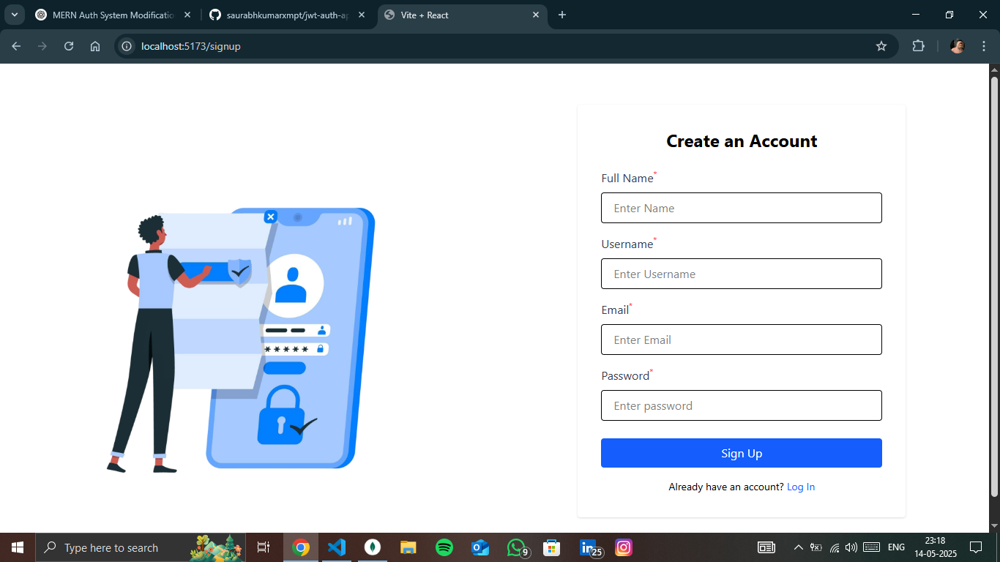
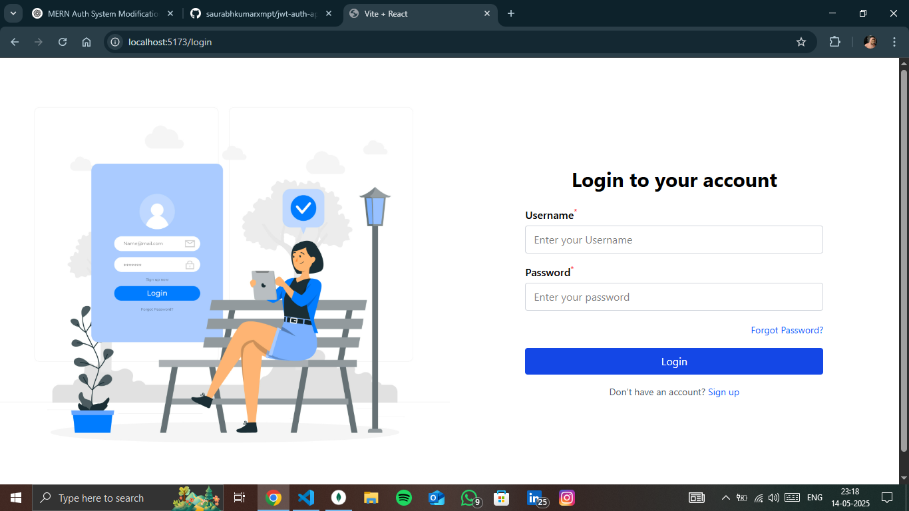
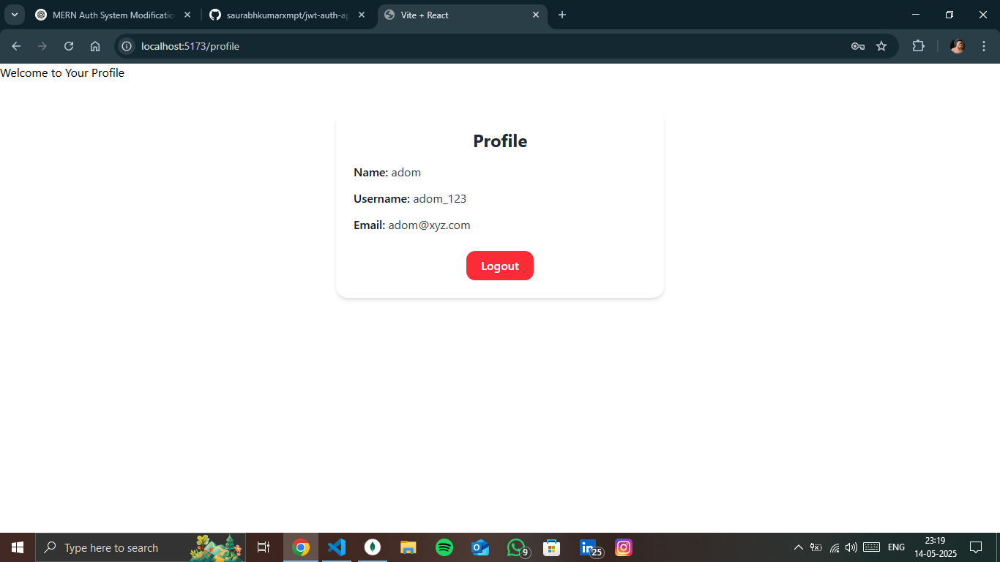

# JWT Authentication System in MERN Stack

This is a simple authentication system built using the MERN stack (MongoDB, Express.js, React.js, and Node.js). This is my second project using MERN.

In this app, users can sign up and they receive a welcome email after registration. I'm using JWT for authentication and Bcrypt to hash passwords.

I haven't added the "Forgot Password" feature yet, but I plan to include it in the coming days.

Overall, it's a basic auth system where I focused on learning how signup, login, tokens, and email services work together.


### Features

- **User Signup**: Users can sign up with their name,username,email and password.
- **Email Notification**: After signing up, users receive a welcome email.
- **Login**: Users can log in with their username and password.
- **JWT Authentication**: JWT tokens are used to keep the user logged in.

### To Do

- **Forgot Password**: I haven't implemented this feature yet, but I'll add it soon.

---

## How to Use

### Setup

1. **Clone the repository**:
   ```bash
   git clone https://github.com/saurabhkumarxmpt/jwt-auth-app.git
   cd jwt-auth-app
   ```

2. **Install dependencies**:
   - For backend:
     ```bash
     cd server
     npm install
     ```
   - For frontend:
     ```bash
     cd client
     npm install
     ```

3. **Create a `.env` file in the `server` directory** and add your MongoDB URI and email service details:
   ```env
   MONGO_URI=your_mongo_connection_string
   JWT_SECRET=your_jwt_secret
   PORT=your_server_port
   EMAIL_USER=your_email
   EMAIL_PASS=your_email_password
   ```

4. **Run the project**:
   - In the `server` folder:
     ```bash
     nodemon server.js
     ```
   - In the `client` folder:
     ```bash
     npm run dev
     ```

---

## 🔥 Screenshots

### 📝 Signup Page


### 🔐 Login Page


### 👤 Profile Page



---

### How to Test

1. **Sign Up**: Go to the signup page, enter your name,username,email and password, and submit. You'll get a welcome email.
2. **Login**: After signing up, use the credentials to log in.
3. **Profile**: Once logged in, you can view your profile and logout form profile.

---

### License

This project is open-source and free to use.
